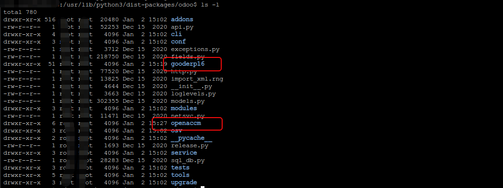

首先说明，OpenACCM模块依赖于GoodERP16版本的若干个模块。所以，在安装本部分前，请先下载GoodERP16模块在安装目录下。
目录结构一般如：

快速安装部署目录效果，安装过程见后面“安装步骤”：

    - /usr/lib/python3/dist-packages/odoo$
    -- /usr/lib/python3/dist-packages/odoo/gooderp16
    -- /usr/lib/python3/dist-packages/odoo/openaccm

## 安装步骤
### 1. 将Ubuntu升级到最新

    $ sudo apt-get update 
    $ sudo apt-get upgrade

### 2. Postgresql数据库安装

    $ sudo apt-get install postgresql

### 3. Odoo服务安装
下载Odoo指定版本最新版，本处为Odoo16

    $ cd /
    $ wget https://nightly.odoocdn.com/16.0/nightly/deb/odoo_16.0.latest_all.deb

安装Odoo及其依赖包

    $ sudo dpkg -i odoo_16.0.latest_all.deb

上述命令执行后会提示缺少依赖包错误，请按下面命令安装需要的依赖包

    $ sudo apt-get -f install

### 4. 服务启动/停止/重启
Odoo服务启动/停止/重启

    $ sudo service odoo start/stop/restart

Postgresql服务启动/停止/重启

    $ sudo service postgresql start/stop/restart

### 5. 开启防火墙
现在Odoo已经运行，并通过5432端口连接到了PostgreSql数据库，已开始监听8069端口。可通过以下脚本验证是否可正常访问，正常访问将返回 200：

    $ sudo wget http://127.0.0.1:8069

如果你的Ubuntu服务器有防火墙保护，请开放8069端口以供其他Web用户访问。开启防火墙命令如下：

    $ sudo ufw allow 8069/tcp

验证访问成功：http://<服务器的IP地址>:8069

### 6. 查看服务是否启动
查看Odoo服务进程

    $ sudo ps auxww | grep -i odoo

查看PostgreSql服务进程

    $ sudo ps auxww | grep -i postgresql

或者

    $ sudo lsof -i:8069

### 7. Odoo及PostgreSQL安装目录结构
用以下命令，查看PostgreSQL:

    $ sudo ps auxww | grep -i postgresql

运行结果
/usr/lib/postgresql/12/bin/postgres -D /var/lib/postgresql/12/main -c config_file=/etc/postgresql/12/main/postgresql.conf

运行文件：/usr/lib/postgresql/12/bin/postgres
数据文件：/var/lib/postgresql/12/main
配置文件：/etc/postgresql/12/main/postgresql.conf

用以下命令，查看Odoo:

    $ sudo ps auxww | grep -i  odoo

运行结果
/usr/bin/python3 /usr/bin/odoo --config /etc/odoo/odoo.conf --logfile /var/log/odoo/odoo-server.log

运行文件：/usr/bin/python3 /usr/bin/odoo
配置文件：/etc/odoo/odoo.conf
日志文件：/var/log/odoo/odoo-server.log

### 8. Odoo nginx 80端口极简配置
安装好odoo以后，默认的访问端口是8069，访问起来既不美观也不方便
那么我们可以使用nginx做一个反向代理将odoo代理到80端口上。本文介绍的nginx反向代理搭建于ubuntu20.04
（本文档按单一节点代理配置进行说明）

#### 8.1.安装nginx

    $ sudo apt-get update      # 更新源 

    $ sudo apt-get install nginx  # 下载nginx 

    依次输入后提示Do you want to continue（是否继续）？，输入大写的Y后回车

等待1分钟左右，即完成安装。

#### 8.2 确定nginx 正常
如何确定nginx 正常运行了呢，验证访问成功：http://<服务器的IP地址> ，可以看到如下图像

#### 8.3 修改nginx参数
修改Odoo默认访问端为8069为80端口。常用的文本编辑是vim。

    $ sudo vi /etc/nginx/site-available/default   # 查看访问 nginx 的默认配置

将该文件内容替换为：

    server {
        server_name www.op-ac.com			# 此处用域名节点来作为server_name标识
        listen 80; 
        
        location / {
            proxy_pass http://127.0.0.1:8069;	# 此处实现80端口对8069端口的代理（测试环境配置本句也可）
            proxy_set_header Host $host:80;	# 配置是改变http的请求头, Host请求的主机名（生产环境建议配置）
            proxy_set_header X-Real-IP $remote_addr;		# 请求的真实IP（生产环境建议配置）
            proxy_set_header X-Forwarded-For $proxy_add_x_forwarded_for;		# 请求是由谁发起的（生产环境建议配置）
        }
    }

#### 8.4 重启nginx服务使用配置生效
    
    $ sudo service nginx reload

做完如上三步骤（安装模块、修改配置、重启服务），odoo 80端口转发完毕，可以直接通过 http://<服务器的IP地址> 访问到我们部署的odoo服务。
————————————————

版权声明：本文为CSDN博主「Odoo老邹」的原创文章，遵循CC 4.0 BY-SA版权协议，转载请附上原文出处链接及本声明。
原文链接：https://blog.csdn.net/weixin_38708145/article/details/128702814